# SQL - Análisis de Datos para una Tienda Distribuidora de Equipamiento de Montaña y Aventura

## Descripción
Este proyecto consiste en el análisis de datos de una tienda distribuidora de equipamiento de montaña y aventura, que incluye ropa y accesorios de aventura. El análisis se enfoca en los principales ejes del negocio: ventas, clientes (tiendas), productos y canales.

El código utilizado para resolver las consultas del proyecto se puede consultar en el archivo "Caso.sql". 

## Objetivos del Proyecto
- Identificar productos de alto margen y aquellos que están en tendencia.
- Optimizar la gestión de clientes mediante segmentación y análisis de potencial de desarrollo.
- Analizar la evolución de la facturación y la contribución de diferentes canales y productos.
- Análisis de los ingresos y gastos
- Implementar un sistema de recomendación de productos.

## Herramientas y Tecnologías
El análisis se ha realizado utilizando SQL para la manipulación y análisis de datos y Power BI para la creación de los gráficos. 

## Metodología
El análisis se realizó a través de varias etapas, que incluyen la revisión y limpieza de datos, la creación de tablas agregadas, y el análisis detallado de los pedidos, productos y clientes.

## Punto de partida
- La tabla de ventas contiene 149,257 registros.
- Revisión de los registros duplicados en la tabla de ventas por combinación de tienda, producto, canal y fecha.
- A partir de la tabla ventas, se crea la tabla ventas agregadas, agrupando por fecha, id_producto, id_tienda, y id_canal. Se incluye en esta tabla la facturación como multiplicación de la cantidad por el precio de oferta. La tabla ventas agregadas tiene un total de 134.688 registros. Con esta tabla realizamos gran parte del análisis. 

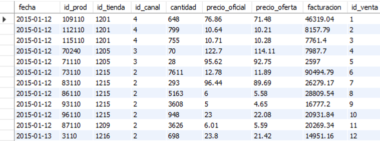

### Diagrama ER
Se relaciona la tabla creada `ventas_agr` con el resto de las tablas.

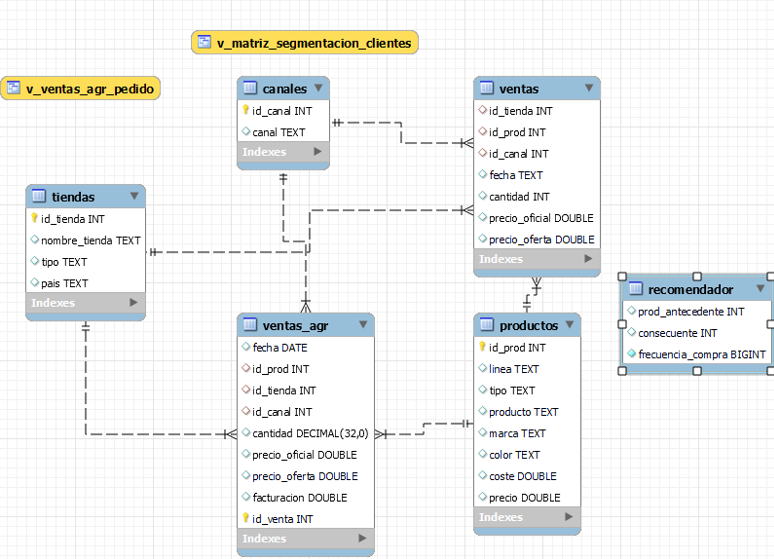

Además, se crea una vista sobre la tabla de `ventas_agr` para analizar los pedidos, considerando un mismo pedido cuando se haya hecho en la misma fecha, por la misma tienda y por el mismo canal.

### Análisis de Pedidos
- Número de pedidos: 22,721
- Información de ventas desde 01/2012 hasta julio de 2018
- 274 productos distintos
- 562 tiendas distintas

### Análisis de Canales y Mejores Clientes
- Los canales con mayor facturación son: Web, teléfono y email. Siendo el canal Web el más destacado con diferencia. 
Evolución mensual de la facturación por canal en los últimos 12 meses:

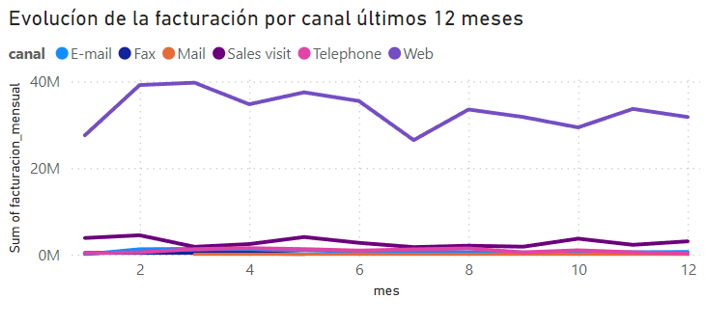

### Mejores Clientes por Facturación

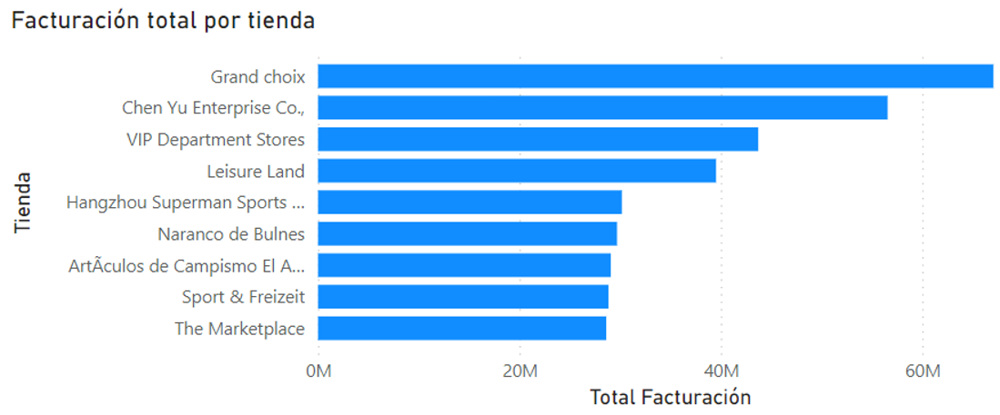

### Evolución de la Facturación por País por Trimestre

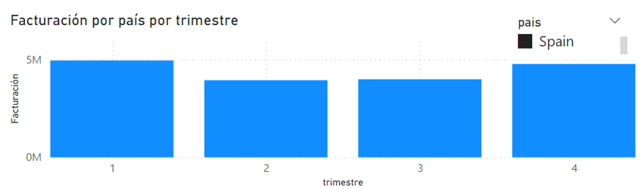

- Evolución de la Facturación por trimestre en 2017 filtrado comparando España con los paises en los que la facturación fue mayor. 

## Análisis del Margen
- Identificación de los 20 productos con mayor margen por línea de producto, calculando el margen como ((precio - coste) / coste * 100). 
  
  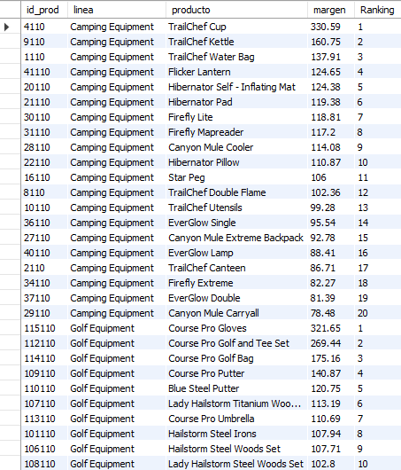

- Identificación de los productos que tienen un descuento superior al 90% de los descuentos. Son los productos que tienen los descuentos más altos, aquellos cuyo descuento es en el 10% superior de todos los descuentos aplicados.
  
### Identificación de productos con mayores descuentos

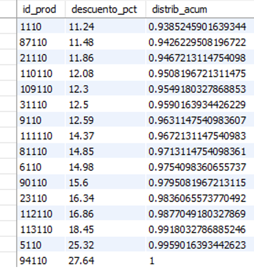

## Análisis del portfolio. 
#### Reducción de Gastos
- Se están vendiendo 144 productos distintos.
- Identificación de productos que contribuyen al 90% de la facturación actual y aquellos que podrían eliminarse sin afectar significativamente la facturación.
- Identificación de los productos que se podrían eliminar manteniendo el 90% de la facturación. 

#### Incremento de Ingresos
- Análisis de las diferentes líneas de productos vendidas:
  - Camping Equipment
  - Mountaineering Equipment
  - Personal Accessories
  - Outdoor Protection
  - Golf Equipment

#### Contribución en % de cada línea de producto al total de la facturación:

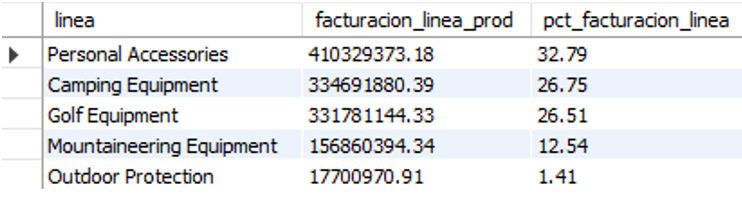

Se podría prescindir de la línea Outdoor Protection, ya que supone solo un 1.41% de la facturación total.

### Identificación de productos en tendencia dentro de la línea de mayor facturación, Personal Accesories. 

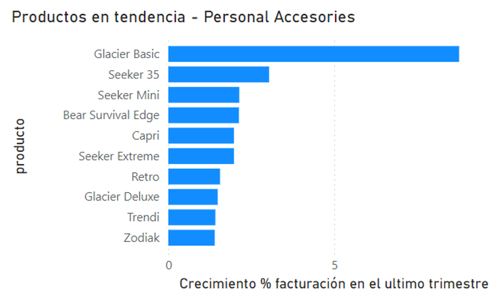

## Optimización de la Gestión de Clientes
- Creación de una matriz de segmentación de clientes basada en el número de pedidos y la facturación de cada tienda.
- Segmentación de clientes en 4 segmentos según si cada métrica está por encima o por debajo de la media correspondiente.

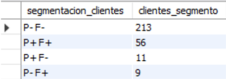

### Potencial de Desarrollo
En este análisis, se identifica el potencial de desarrollo de las tiendas segmentadas por tipo, basándonos en la facturación. 
Se ha calculado el percentil 75 de la facturación para cada tipo de tienda, estableciendo un objetivo de facturación para las tiendas que están por debajo de este umbral. 
El análisis muestra cuánto podrían aumentar su facturación estas tiendas para alcanzar el percentil 75, permitiendo así identificar oportunidades de crecimiento.

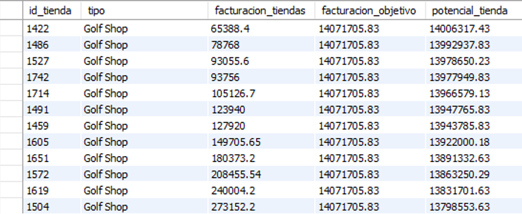

### Reactivación de Clientes
- Se identifican 15 tiendas que no han realizado compras en los últimos 3 meses.
  
### Sistema de Recomendación Item-Item
Se crea un sistema de recomendación item-item que identifica productos frecuentemente comprados juntos en el mismo pedido. 
Este sistema permite a las tiendas recibir recomendaciones basadas en su historial de compras, excluyendo productos ya adquiridos. Se hace a nivel pedido para evitar problemas de tendencias o estacionalidad. 
Ejemplo para la tienda con id “1201”: 

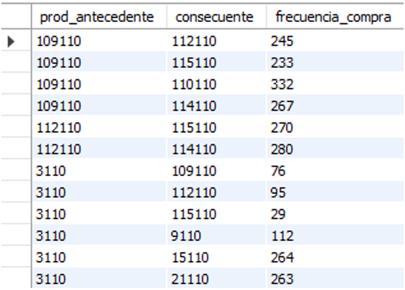

Muestra los productos que se compraron juntos en el mismo pedido, ordenados por el número de veces que estos productos han sido comprados conjuntamente, por tanto los productos a recomendar. 
Se consideran excepciones importantes: Se excluyen productos consigo mismos y se eliminan combinaciones duplicadas. 
